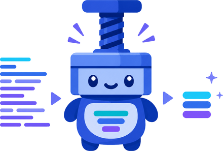

<p align="center">
  
</p>

<p align="center">
  <strong>TokenPress</strong>
</p>

<p align="center">
  <strong>에이전틱 코딩을 위한 포매터 — 사람이 아니라 토크나이저에 맞춰 최적화합니다.</strong>
</p>

<p align="center">
  <a href="https://github.com/starone99/TokenPress/actions"></a>
  <a href="LICENSE"></a>
</p>

<p align="center">
  <a href="README.md">English</a> ·
  <b>한국어</b> ·
  <a href="README_ja.md">日本語</a> ·
  <a href="README_zh.md">中文</a> ·
  <a href="README_es.md">Español</a> ·
  <a href="README_fr.md">Français</a> ·
  <a href="README_pt.md">Português</a>
</p>

> 이 번역은 뒤처질 수 있습니다. 기준 문서는 [README.md](README.md)이며, 수치나
> 설명이 어긋날 경우 영문 쪽이 맞습니다.

---

에이전틱 코딩을 하고 있다면, 왜 아직도 사람이 읽으라고 만든 포매터를 쓰고
있나요? Black, gofmt, rustfmt, Prettier는 모두 사람의 눈에 맞춰 최적화합니다 —
줄 너비, 정렬, 항목 사이의 빈 줄. 읽는 쪽이 모델이라면 그중 무엇도 가치가
아닙니다. 청구되는 토큰일 뿐입니다.

TokenPress는 같은 프로그램을 가장 적은 입력 토큰으로 표현합니다:

```text
minimize  tokenizer.encode(transformed_code)
s.t.      변환된 코드가 파싱되고, 컴파일되고, 동일하게 동작할 것
```

미니파이어가 아닙니다 — 문자 수와 토큰 수는 일치하지 않으므로, 변환은 실제
토크나이저를 기준으로 선택됩니다. **검증에 실패한 출력은 절대 기록되지
않으며**, 식별자와 문자열 내용은 결코 건드리지 않습니다.

## 얼마나 줄어드나

각 행은 **실제 오픈소스 코드베이스**이며, 커밋을 고정한 상태로 전체를 포맷하고
모든 파일이 검증을 통과한 결과입니다. 채워진 막대는 *모든* 토크나이저가
보장하는 절감이고, 흐린 꼬리는 가장 유리한 토크나이저가 더 나아가는 거리입니다.

**Aggressive 설정** — 주석과 독스트링까지 제거하는 선택적 플래그:

```text
target codebase       0%   10%  20%  30%  40%  50%  60%
──────────────────────├────┼────┼────┼────┼────┼────┤
tokio (Rust)          █████████████████████████░░░      -50.5 … -55.2%
ripgrep (Rust)        ███████████████████░░             -37.3 … -42.7%
langchain (Python)    ███████████████████░░             -37.1 … -41.1%
fastapi (Python)      ██████████████████░░              -36.1 … -40.1%
requests (Python)     ████████████████░░                -31.9 … -36.5%
transformers (Python) ███████████████░░░                -30.3 … -36.1%
uv (Rust + Python)    ███████████░                      -21.4 … -24.7%
django (Python)       ██████████░░                      -20.7 … -24.8%
```

**기본 설정** — 같은 코드베이스, 플래그 없음. 주석·독스트링·타입 어노테이션은
모두 유지되고, 공백·빈 줄·들여쓰기만 사라집니다:

```text
target codebase       0%   10%  20%  30%  40%  50%  60%
──────────────────────├────┼────┼────┼────┼────┼────┤
fastapi (Python)      ███████████░░                     -21.6 … -26.7%
ripgrep (Rust)        ████████░░░                       -16.6 … -22.8%
uv (Rust + Python)    ███████░                          -13.1 … -16.8%
langchain (Python)    ██████░░                          -12.2 … -15.6%
tokio (Rust)          ██████░░░░                        -11.5 … -19.1%
django (Python)       █████░                            -9.8 … -12.6%
requests (Python)     ████░                             -7.3 … -9.7%
transformers (Python) ████░                             -7.0 … -10.3%
```

순서가 바뀐 것에 주목하세요. tokio가 aggressive 차트에서 1위인 이유는 doc 주석이
빽빽하기 때문입니다 — 그것을 지우면 리포의 절반이 사라집니다. 하지만 기본
설정에서는 중위권인데, 남은 것이 공백뿐이기 때문입니다. **기본 설정 수치는
아무 대가도 치르지 않는 절감**이고, aggressive 수치는 당신이 선택하는
트레이드오프입니다.

각 행 안의 폭도 요점입니다: 절감률은 토크나이저마다 다르고, 그래서 벤치마크는
여섯 개를 측정합니다 — GLM-5.2, Kimi K3, Gemma 4, Qwen3.6, `o200k_base`,
`cl100k_base`. 나머지 다섯 언어는 코드베이스 하나씩, aggressive, 같은 실행:

```text
target codebase       0%   10%  20%  30%  40%  50%  60%
──────────────────────├────┼────┼────┼────┼────┼────┤
commons-lang (Java)   █████████████████████░░           -42.9 … -46.6%
express (JS)          █████████████░░░░                 -25.4 … -33.3%
rack (Ruby)           █████████░                        -18.2 … -20.8%
gin (Go)              █████████░                        -18.7 … -20.0%
```

**비공개·폐쇄형 토크나이저는 측정하지 않았고, 여기 어떤 수치도 그쪽으로
외삽하지 않습니다.** 절감률은 언어가 아니라 트리에서 산문이 차지하는 비중을
따르며, 언어당 코퍼스 하나는 데이터 포인트일 뿐 언어 전체에 대한 기대치가
아닙니다. 13개 코퍼스, 원시 토큰 수, 토크나이저별 표, 줄바꿈 문자 관련 주의사항은
[benchmarks/RESULTS.md](benchmarks/RESULTS.md)에 있고
[benchmarks/SHOWCASE.md](benchmarks/SHOWCASE.md)가 요약합니다.

**주석과 독스트링을 지우면 모델이 참고할 수 있었던 문맥이 사라지는데, 그것이
답변 품질을 떨어뜨리는지는 측정하지 않았습니다.** 절감은 측정됐고 품질
트레이드오프는 측정되지 않았습니다. aggressive 플래그는 공짜가 아니라 선택으로
다루세요.

## 이 코드를 사람이 읽습니까?

이 질문 하나가 사용법을 결정합니다.

**읽는다 — 모델에 넘길 사본에만 돌리고 소스는 그대로 두세요.** 프롬프트에
붙여넣고, 에이전트의 컨텍스트 윈도우에 넘기고, RAG 인덱스에 넣으세요. 기본
설정에서도 마찬가지입니다: 기본 실행도 빈 줄을 지우고 들여쓰기를 줄입니다. 여기서
"context-lossless"는 *모델*이 복원할 수 있는 정보에 대한 주장이지, 사람이 읽기
좋다는 뜻이 아닙니다.

**읽지 않는다 — 아무도 안 읽고, 리포를 에이전트가 쓰고 관리한다 — 그렇다면
소스 자체를 정규화하는 것이 일관됩니다.** pre-commit 훅과 GitHub Action이 바로
그것을 위해 있습니다. 다만 먼저 알아둘 두 가지가 있고, 둘 다 사람 독자와는
무관합니다:

- **Rust는 모든 줄을 합칩니다.** 기본 설정에서 Rust 백엔드는 파일 전체를 한 줄로
  다시 씁니다. 줄 단위로 주소를 매기는 편집 도구, `git diff`, 머지 충돌, 스택
  트레이스가 모두 무력해집니다. 다른 백엔드는 줄바꿈을 유지합니다.
- **기본 설정에서도 주석은 사라지고, 정도는 언어마다 다릅니다.** Rust는 `//`와
  `/* */`를 전부 버립니다 — `syn` 토큰 스트림에서 재생성하므로 `///`와 `//!`
  문서 주석만 살아남습니다. JS/TS는 자체 줄을 차지한 주석은 남기고 코드와 같은
  줄에 있는 주석은 버립니다. 나머지 다섯은 둘 다 유지합니다. 되돌리는 기능은
  없고, 훅 아래에서는 일회성 변환이 아닙니다 — 이후 누가 쓴 주석이든 다음
  실행에서 지워집니다.

역매핑이 없습니다: 소스맵도, 패치 백도 없습니다. 모델이 포맷된 코드를 읽고 답할
수는 있지만, 그 사본을 기준으로 만든 diff는 포맷하지 않은 원본에 적용되지
않습니다. **모델이 편집할 파일은 포맷하지 않은 채로 주세요.**

**TokenPress는 TokenPress 자신에게 TokenPress를 돌립니다.** 자체
[`.pre-commit-config.yaml`](.pre-commit-config.yaml)의 `tokenpress-format` 훅으로,
기본 설정에서 **-22.6%**, 253,666 → 196,415 토큰. 대가는 이 절이 설명하는 바로
그것이고 알고서 치렀습니다 — 평문 주석 1,941줄 삭제, `git blame`과 스택 트레이스
열화, 근거는 커밋 메시지와 `docs/`로 이동. 테스트와 100% 커버리지 게이트는 그대로
통과했습니다. 전후 전체는
[SHOWCASE.md](benchmarks/SHOWCASE.md#the-fourteenth-codebase-tokenpress-itself-which-does-use-it)에.

**에디터 플러그인과 format-on-save가 없는 것도 같은 이유입니다.** 대부분의
사람이 Black·Prettier·rustfmt를 만나는 경로가 그것이지만, TokenPress에는 있으면
안 되는 통합입니다. 에디터에 열려 있는 파일은 정의상 사람이 읽는 파일이니까요.
저장할 때마다 이것을 돌리는 확장은, 위 질문이 묻는 바로 그 경우에 틀립니다.

## 프로젝트에 적용하기

다른 포매터와 마찬가지로, 버전은 당신의 머신이 아니라 프로젝트에 속합니다 —
그렇지 않으면 서로 다른 버전을 쓰는 두 사람이 상대의 파일을 영원히 다시
포맷합니다. 훅이나 Action에 고정해 두면 아무도 따로 설치할 필요가 없습니다.

**pre-commit** — 프레임워크가 고정된 리비전을 직접 받아 빌드합니다:

```yaml
# .pre-commit-config.yaml
repos:
  - repo: https://github.com/starone99/TokenPress
    rev: v0.1.0                  # 고정이 핵심입니다 — 의도적으로만 올리세요
    hooks:
      - id: tokenpress-check     # 아무것도 쓰지 않고, 바뀔 것이 있으면 실패
    # - id: tokenpress-format    # 파일을 덮어씁니다. 위의 질문을 먼저 읽으세요.
```

**GitHub Action** — 기존 워크플로에 한 스텝:

```yaml
- uses: starone99/TokenPress@v0.1.0
  with:
    paths: src tests
    mode: check                  # `format`은 워크스페이스를 덮어씁니다
```

**`tokenpress.toml`** — 언어별 플래그. 상위 디렉터리에서 찾아 쓰므로 훅과
Action과 직접 실행이 모두 같은 설정을 봅니다:

```toml
[python]
strip_comments = true
[rust]
strip_doc_comments = true
```

두 통합 모두 기본값은 `check`이고 아무것도 쓰지 않습니다. `format`은 위 질문의
"아무도 읽지 않는다" 쪽에서만 쓰세요. 옵션과 플래그/설정 대응표, cargo feature는
[INTEGRATIONS.md](docs/INTEGRATIONS.md)에 있습니다.

**브랜치가 아니라 릴리스 태그에 핀하세요.** 태그면 두 통합 모두 그 릴리스의
바이너리를 받아 릴리스의 `SHA256SUMS`로 검증합니다 — 수 초면 끝나고 Rust 툴체인도
C 컴파일러도 libclang도 필요 없습니다. 브랜치나 단순 커밋은 대응하는 릴리스
바이너리가 없어서 체크아웃에서 CLI를 컴파일합니다: 정확하지만 수 초가 아니라 수 분
걸립니다. 릴리스가 싣는 것보다 작은 바이너리를 요구할 때도 — 훅의
`TOKENPRESS_NO_RUBY` 등, Action의 `ruby`/`go`/`java`/`csharp` 입력 — 같은 이유로
컴파일하며, 릴리스에 아카이브가 없는 호스트(Windows, Intel macOS, x86_64가 아닌
모든 Linux)도 마찬가지입니다. `TOKENPRESS_NO_PREBUILT=1`은 소스 빌드를 강제합니다.

## 직접 실행하기

일회성으로 — 트리를 측정하거나, 모델에 넘길 사본을 만들려면 — CLI를 설치하세요.

```bash
# 설치 스크립트: 호스트에 맞는 릴리스를 받아, 추출 전에 릴리스의 SHA256SUMS로 검증합니다
curl -fsSL https://raw.githubusercontent.com/starone99/TokenPress/master/install.sh | sh
```

```powershell
irm https://raw.githubusercontent.com/starone99/TokenPress/master/install.ps1 | iex
```

```bash
# Rust 툴체인이 있다면
cargo install --git https://github.com/starone99/TokenPress tokenpress-cli
```

미리 빌드된 아카이브와 `SHA256SUMS`는
[릴리스 페이지](https://github.com/starone99/TokenPress/releases)에 Linux x86_64,
macOS(Apple Silicon), Windows x86_64용으로 있습니다. Intel macOS를 포함한 그 외 플랫폼은
소스에서 빌드합니다. `TOKENPRESS_VERSION`으로 태그를 고정하고
`TOKENPRESS_BIN_DIR`로 설치 위치를 바꿉니다. Ruby·Go·Java·C# 백엔드를 빌드하려면
C 컴파일러가, Ruby에는 libclang이 추가로 필요합니다 — `--no-default-features`는
둘 다 필요 없고, `--features go,java`로 원하는 것만 다시 넣습니다.

그다음:

```bash
tokenpress stats  <PATH>...        # 얼마나 줄어드는지 — 아무것도 쓰지 않음
tokenpress diff   <PATH>...        # unified diff — 아무것도 쓰지 않음
tokenpress format <PATH>...        # 제자리에서 덮어쓰기 (디렉터리는 재귀 탐색)
tokenpress check  <PATH>...        # 바뀔 것이 있으면 exit 1
```

`stats`부터 시작하세요. 아무것도 건드리지 않고, 당신의 트리에서 이것이 값어치가
있는지 알려줍니다:

```bash
tokenpress stats . --tokenizer o200k_base            # GPT-4o / o-series (기본값)
tokenpress stats . --tokenizer cl100k_base           # GPT-4 / GPT-3.5
tokenpress stats . --tokenizer hf:tokenizer.json     # 모든 HF 토크나이저 (Qwen, GLM, Gemma…)
tokenpress stats . --tokenizer kimi:tiktoken.model   # Kimi ranks 형식
```

정보를 잃는 것은 모두 선택적 플래그이고, 각각 무엇이 깨지는지 밝힙니다:

```bash
--py-strip-comments        # # 주석 제거
--py-strip-docstrings      # __doc__ 을 비움 — help() 와 doctest 가 깨짐
--py-strip-annotations     # dataclass/pydantic 런타임 내성이 깨짐
--py-no-merge-imports      # 인접한 import 를 합치지 않음
--rs-strip-doc-comments    # /// 와 //! 제거 — rustdoc 과 doctest 도 함께
--js-strip-comments        # 살아남는 JS/TS 주석마저 제거
--ruby-strip-comments      # 셔뱅과 매직 주석은 유지
--go-strip-comments        # //go: 지시문, 빌드 제약, cgo 프리앰블은 유지
--java-strip-comments      # Javadoc 포함
--csharp-strip-comments    # /// XML 문서 포함
```

종료 코드: `0` 정상 · `1` check 가 변경을 발견 · `2` 오류. 파싱과 검증 실패는
파일별로 보고되며, 손상된 것은 결코 기록되지 않습니다.

## 동작 방식

```text
  소스 ──▶ 파싱 ──▶ 최소 토큰 비용으로 재출력 ──▶ 검증 ──▶ 기록
                                                    │
                                      ┌─────────────┴─────────────┐
                                      │ 재파싱                    │
                                      │ AST / 토큰 동등성         │
                                      │ 해당 언어의 자체 툴체인   │  ← --verify external
                                      └─────────────┬─────────────┘
                                                    │
                                            실패 ───┴──▶ 파일은 그대로 둠
```

마지막 단계가 설계의 전부입니다. 동등함을 증명할 수 없는 변환은 기록되지 않으므로,
최악의 경우는 파일이 그대로 남는 것이지 손상되는 것이 아닙니다.

## 언어 지원

**Python과 Rust가 주력입니다** — 이 프로젝트가 그것을 위해 만들어졌고, 벤치마크가
가장 깊게 다루며, 작업이 먼저 갑니다. 나머지 다섯도 같은 불변식과 같은 검사 위에서
지원되지만, 각각 코퍼스 하나에 기대고 있습니다.

| 언어 | 확장자 | 기본 설정에서 주석 유지 | 외부 검증 |
|---|---|---|---|
| **Python** | `.py` | ✅ | ❌ 내장 검사만 |
| **Rust** | `.rs` | ❌ `//` 와 `/* */` 는 항상 사라짐 | ❌ 내장 검사만 |
| JavaScript / TypeScript | `.js` `.mjs` `.cjs` `.jsx` `.ts` `.mts` `.cts` `.tsx` | ⚠️ 부분적 | ✅ `tsc --noEmit` |
| Ruby | `.rb` `.rake` `.gemspec` `.ru`, `Gemfile`, `Rakefile` | ✅ | ✅ `ruby -c` |
| Go | `.go` | ✅ | ✅ `gofmt -e` |
| Java | `.java` | ✅ | ✅ `javac`, 파싱 단계에서 중단 |
| C# | `.cs` | ✅ | ✅ Roslyn `csc` |

마지막 열은 바로 위 문단과 충돌하며, 그 사실을 숨기지 않고 여기 적습니다:
**주력인 두 언어가 외부 검증이 없는 두 언어입니다.** Python과 Rust는 내장 검사만
있습니다. 이것이 프로젝트에서 가장 약한 지점이고, 이를 메우는 것이
[로드맵](ROADMAP.md)의 첫 항목입니다.

언어별 상세 — 각 백엔드가 무엇을 유지하고 무엇을 못 하는지, 외부 검사기가 어떻게
호출되는지 — 는 [LANGUAGES.md](docs/LANGUAGES.md)에 있습니다.

## 문서

| | |
|---|---|
| [LANGUAGES.md](docs/LANGUAGES.md) | 언어별 지원, 캐비엇, 외부 검사기 |
| [INTEGRATIONS.md](docs/INTEGRATIONS.md) | pre-commit, GitHub Action, 설정 파일, cargo feature |
| [CHANGELOG.md](CHANGELOG.md) | 변경 내역, 출력에 영향을 주는 항목 표시 |
| [benchmarks/RESULTS.md](benchmarks/RESULTS.md) | 전체 방법론, 13개 코퍼스, 6개 토크나이저 |
| [benchmarks/SHOWCASE.md](benchmarks/SHOWCASE.md) | 요약과 토크나이저별 ≥40% 후보 |
| [ROADMAP.md](ROADMAP.md) | 다음 작업과 열려 있는 질문들 |
| [CONTRIBUTING.md](CONTRIBUTING.md) | 빌드·테스트와 백엔드별 필요한 툴체인 |
| [SECURITY.md](SECURITY.md) | 취약점 신고, 위협 모델, 릴리스 무결성 |

## 개발

TDD와 하드 게이트: `scripts/coverage.ps1` (Windows) / `scripts/coverage.sh` 는
줄 커버리지 100% 미만이면 빌드를 실패시킵니다. CI 는 clippy `-D warnings`,
Linux·Windows 테스트, 그 게이트를 돌립니다 — 따라서 위의 CI 배지가 초록인 것
자체가 커버리지 주장이며, 아무도 확인하지 않는 숫자를 배지가 우기는 방식이
아닙니다.

**여기서 `cargo fmt` 를 돌리지 마세요.** 이 저장소는 자기 소스를 TokenPress 로
포맷하므로 rustfmt 는 CI 에 없고, 돌려봐야 훅이 되돌릴 diff 만 만듭니다. 규칙은
[CONTRIBUTING.md](CONTRIBUTING.md)에 있고, `//` 주석이 살아남지 않는 만큼 근거를
어디에 둘지도 거기 적혀 있습니다.

## 라이선스

Apache License, Version 2.0 ([LICENSE](LICENSE) 또는
<https://www.apache.org/licenses/LICENSE-2.0>).

명시적으로 달리 밝히지 않는 한, Apache-2.0 라이선스에 정의된 대로 이 저작물에
포함되도록 의도적으로 제출한 모든 기여는 별도의 조건 없이 위와 같이
라이선스됩니다.
